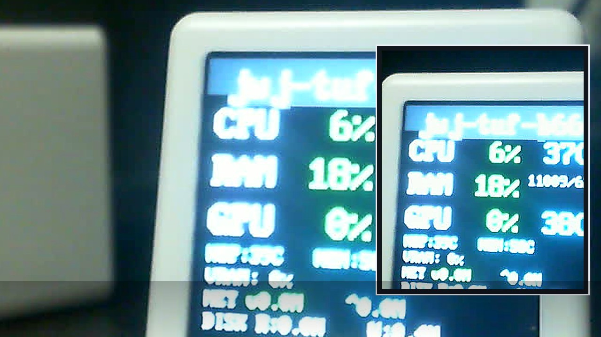

# Mochi-Metrics

把電腦的系統資訊（CPU / RAM / GPU / 網路 / 磁碟）透過 MQTT 傳到 ESP12，並在小螢幕即時顯示。



## 這個專案可以做什麼

- 在 ESP12 顯示器上看到主機即時監控數據
- 支援多台主機（用 hostname 分 topic）
- 提供 WebUI 設定 MQTT 與顯示參數
- Sender 支援 Python（推薦）與 Go

## 硬體型號資訊

| 元件 | 型號 |
|---|---|
| LCD | `BL-A54038P-02` |
| Wi-Fi 模組 | `ESP-12F` |

## 你現在想做哪一件事

1. 先看完整安裝教學（推薦第一次）  
請看：[圖文安裝與使用指南](docs/guide/安裝與使用指南.md)
2. 我已經接好硬體，只想快速跑起來  
請看下方「5 分鐘快速開始」
3. 我只想改 Sender 或韌體  
請看「開發者命令速查」

## 5 分鐘快速開始

### 1) 編譯並燒錄韌體

```bash
cd apps/firmware
~/.platformio/penv/bin/pio run
~/.platformio/penv/bin/pio run -t upload
~/.platformio/penv/bin/pio device monitor --baud 115200
```

### 2) 啟動 Python Sender（Ubuntu 推薦）

```bash
cd apps/sender/python
chmod +x senderctl.sh
./senderctl.sh quickstart-compose
```

常用管理：

```bash
./senderctl.sh compose-status
./senderctl.sh compose-logs
```

### 3) 在 ESP WebUI 設定 MQTT

- 開瀏覽器進入 ESP 顯示的 IP（例如 `http://192.168.x.x/monitor`）
- 設定 broker：`MQTT_HOST` / `MQTT_PORT` / 帳密
- Topic 使用：`sys/agents/+/metrics/v2`

### 4) 驗證成功

- 螢幕出現 `MQTT OK`
- 有 CPU / RAM / GPU 數值更新
- 若 GPU 使用率是 `0%` 但溫度有值，通常代表目前 GPU 空閒

## 開發者命令速查

### 韌體

```bash
cd apps/firmware
~/.platformio/penv/bin/pio run
~/.platformio/penv/bin/pio test -e native
```

### Python Sender

```bash
cd apps/sender/python
uv sync --extra dev
uv run python -m pytest -q
```

### Go Sender

```bash
cd apps/sender/go
go test ./...
go build -o sender_v2 .
```

## MQTT 規格

- Topic：`sys/agents/<hostname>/metrics/v2`
- Payload 規格：`docs/protocol/metrics-v2.md`

## 常見問題

1. ESP 顯示 `MQTT --`  
先確認 broker 位址/帳密是否正確，再看 Sender 日誌。
2. 只有 CPU/RAM 正常，GPU 一直是 `0%`  
先確認 GPU 溫度是否有值；有值通常是空閒狀態，不是讀取失敗。
3. `quickstart-compose` 啟動失敗  
請先確認 Docker 已啟動，必要時執行：`./senderctl.sh ensure-docker-boot`。
